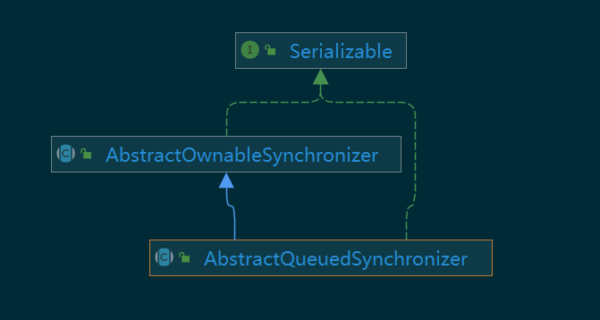

# AbstractQueuedSynchronizer （AQS）类解析

## 类继承结构



其父类 `AbstractOwnableSynchronizer` 如下

```java
public abstract class AbstractOwnableSynchronizer
    implements java.io.Serializable {

    protected AbstractOwnableSynchronizer() { }

    private transient Thread exclusiveOwnerThread;

    protected final void setExclusiveOwnerThread(Thread thread) {
        exclusiveOwnerThread = thread;
    }

    protected final Thread getExclusiveOwnerThread() {
        return exclusiveOwnerThread;
    }
}
```

只有一个 Thread 类型的属性：`exclusiveOwnerThread`。用于记录独占模式下，持有锁的线程；该类的方法也仅仅只是提供get、set该属性的方法。通过这两个方法，我们可以快速确定/修改持有锁的线程。

## 使用方法

要将该类作为实现同步器（synchronizer）基类，需要重写以下方法中的几个

- tryAcquire
- tryRelease
- tryAcquireShared
- tryReleaseShared
- isHeldExclusively

AQS 只允许对以上方法进行重写，且这些方法的默认实现都是抛出 `UnsupportedOperationException`；AQS的其他方法都是 final 的，因此AQS的注释也说。

```tex
Defining these methods is the only supported means of using this class.
```

这（指重定义以上方法）是使用这个类的唯一方式。

为了重写以上方法，可以通过AQS提供的一些方法进行实现；获取/修改状态：getState、setState、compareAndSetState。

```tex
To use this class as the basis of a synchronizer, redefine the following methods, as applicable, by inspecting and/or modifying the synchronization state using {@link #getState}, {@link#setState} and/or {@link #compareAndSetState}
```

文档里提到了 `state`, 那么这个 `state` 是什么？


### AQS里的state是什么

通过注释的指引，我们找到 `setState` 和 `getState `方法定义如下。

```java
    private volatile int state;
	//...
	
	protected final int getState() {
        return state;
    }
	
	protected final void setState(int newState) {
        state = newState;
    }
```

由于`state`是用`volatile`（轻量级锁）修饰的，因此具有内存同步语义，保证了内存的可见性，是线程安全的。

我们再看看 `compareAndSetState `方法定义：

```java
	//...
	protected final boolean compareAndSetState(int expect, int update) {
        return STATE.compareAndSet(this, expect, update);
    }
	//..
	private static final VarHandle STATE;
    static {
        try {
            MethodHandles.Lookup l = MethodHandles.lookup();
            STATE = l.findVarHandle(AbstractQueuedSynchronizer.class, "state", int.class);
            //...
        } catch (ReflectiveOperationException e) {
            throw new ExceptionInInitializerError(e);
        }
		//...
    }	
```

`compareAndSetState`方法从名字上就告诉了我们这是一个 `CAS` 操作，而方法内部是调用了 `STATE` 的 `compareAndSet` 方法，而 `STATE` 正好是和 `AbstractQueuedSynchronizer` 类名称为 `state` 的属性绑定了。现在暂时可以将其看做 `state`属性的访问器。

看到这里，我们大概能明白`AbstractQueuedSynchronizer` 提供该属性的目的：为依赖于用**单个原子值作为状态**的同步器提供基础；state正是表明同步器的某种状态。可以通过`AbstractQueuedSynchronizer`提供的方法修改/获取该属性值，达到同步器的控制目的。

从这里就能发现，**AQS** 实现原理之一是 **CAS**（乐观锁）。


## 内部类-Node

AQS 中的 CLH 队列的变体使用到了该类作为节点类。

```java
static final class Node {
		
    	// 特殊标记，与属性 nextWaiter 共同使用，用于表明是独占模式还是共享模式
    	static final Node SHARED = new Node();
    
        static final Node EXCLUSIVE = null;
    	
    	// 节点状态字段
        static final int CANCELLED =  1;
    	
    	// 如果当前节点为 SIGNAL, 则说明当前节点的后继节点需要唤醒-unpark()
        static final int SIGNAL    = -1;

        static final int CONDITION = -2;

        static final int PROPAGATE = -3;

        volatile int waitStatus;

        volatile Node prev;

        volatile Node next;
		
    	// 入队的线程
        volatile Thread thread;
		
    	// 与常量 SHARED、EXCLUSIVE 作用，表明是否为共享模式。
        Node nextWaiter;
	
        final boolean isShared() {
            return nextWaiter == SHARED;
        }

        final Node predecessor() {
            Node p = prev;
            if (p == null)
                throw new NullPointerException();
            else
                return p;
        }

	    // waitStatus 为0，用于构造虚节点
        Node() {}
		
    	// 由 addWaiter 调用的构造方法
        // nexWaiter表明这个节点的类型（独占/共享）。
        // thread设置为当前的thread，也就是说，每个Node就相当于一个排队的线程
        Node(Node nextWaiter) {
            this.nextWaiter = nextWaiter;
            THREAD.set(this, Thread.currentThread());
        }

        Node(int waitStatus) {
            WAITSTATUS.set(this, waitStatus);
            THREAD.set(this, Thread.currentThread());
        }
        
    	
    	// VarHandle 类型，与上述 STATE 一样，可以理解为指定属性的操作器。
        private static final VarHandle NEXT;
        private static final VarHandle PREV;
        private static final VarHandle THREAD;
        private static final VarHandle WAITSTATUS;
        static {
            try {
                MethodHandles.Lookup l = MethodHandles.lookup();
                NEXT = l.findVarHandle(Node.class, "next", Node.class);
                PREV = l.findVarHandle(Node.class, "prev", Node.class);
                THREAD = l.findVarHandle(Node.class, "thread", Thread.class);
                WAITSTATUS = l.findVarHandle(Node.class, "waitStatus", int.class);
            } catch (ReflectiveOperationException e) {
                throw new ExceptionInInitializerError(e);
            }
        }

    }
```

Node 就是同步队列中的节点，Node 使用 waitStatus 保存当前节点的状态，thread 保存实际的线程。

- AQS 的实现原理之一是 **CLH队列**。


## 核心方法分析

在使用 AQS 类时，实际上是使用 `AbstractQueuedSynchronizer` 提供的以下方法，而不是直接使用我们重写的方法，因为以下方法除了进行获取锁，还帮我们做了线程排队、阻塞等工作。

|          |    获取锁     |    释放锁     |
| :------: | :-----------: | :-----------: |
| 独占模式 |    acquire    |    release    |
| 共享模式 | acquireShared | releaseShared |

### 独占模式

#### void acquire(int arg) 方法分析

```java
    public final void acquire(int arg) {
        // 先调用 tryAcquire 尝试获取锁
        // 如果获取锁失败，则会尝试 acquireQueued
        if (!tryAcquire(arg) &&
            acquireQueued(addWaiter(Node.EXCLUSIVE), arg))
            selfInterrupt();
    }
```

acquire 方法内部先调用了 tryAcquire 方法，这个方法是被子类重写的方法，AQS 的默认实现是抛出异常。如果 tryAcquire 抢占资源失败，则会接连调用 addWaiter、acquireQueued 
方法。如果线程是`acquireQueued`方法中抢锁成功，则会对线程进行中断。

先进入 `addWaiter()` 方法。

#### addWaiter(Node.EXCLUSIVE)方法

```java
    private Node addWaiter(Node mode) {
        // 创建一个新的节点
        Node node = new Node(mode);
		
        // 循环体内，先判断同步队列是否为空，如果不为空，则初始化 head = tail = new Node()
        // 然后使用 CAS 将新创建的结点加入到队尾，最后将结点返回
        for (;;) {
            Node oldTail = tail;
            if (oldTail != null) {
                // 这里是先为 node.prev 节点赋好值，再进行 CAS
                node.setPrevRelaxed(oldTail);
                if (compareAndSetTail(oldTail, node)) {
                 	// CAS 操作成功后，才将前置节点的 next 指向当前的节点
                    oldTail.next = node;
                    return node;
                }
            } else {
                initializeSyncQueue();
            }
        }
    }

    private final void initializeSyncQueue() {
        Node h;
        if (HEAD.compareAndSet(this, null, (h = new Node())))
            tail = h;
    }
```

该方法会新创建一个 waitStatus 等于给定`mode`（这里是`Node.EXCLUSIVE`）的节点，之后将该节点加入到同步队列队尾；如果同步队列为空，则会使用 **CAS** 初始化该队列 
`head = tail = new Node()`。我们可以看到，这里的 head 只是简单的 new Node()，**不是排队的线程节点，即虚节点**。 方法最后会返回当前节点`node`。
**总结一下，这个方法是使用当前线程构造一个节点并加入队列的末尾。**

- **为什么要使用虚节点呢?** 和链表相关的算法题,如 [147. 对链表进行插入排序](https://leetcode-cn.com/problems/insertion-sort-list) 
  也使用到了虚头节点，这样做的好处是：后续处理流程中，不用再对 head == null 判空，节省了时间；是空间换时间的一个方法。

#### acquireQueued(addWaiter(Node.EXCLUSIVE), arg)

```java
    final boolean acquireQueued(final Node node, int arg) {
        boolean interrupted = false;
        try {
            for (;;) {
                // 找到该节点的前任节点 p
                final Node p = node.predecessor();
                // 如果当前节点是第二个节点，则尝试获取锁（可能抢锁失败，因为头节点可能还不会释放锁）
                if (p == head && tryAcquire(arg)) {
                    //  这里 setHead 方法内部，会将 node 设为虚节点并成为新的 head;
                    setHead(node);
                    p.next = null;
                    return interrupted;
                }
                // 检查是否应当停止抢锁并开始阻塞
                if (shouldParkAfterFailedAcquire(p, node))
                    interrupted |= parkAndCheckInterrupt();
                // 如果该线程被中断了，则只有等到获取锁返回时，才会调用 selfInterrupt()
            }
        } catch (Throwable t) {
            cancelAcquire(node);
            if (interrupted)
                selfInterrupt();
            throw t;
        }
    }
```

我们可以看到，该方法循环内部还调用了 `shouldParkAfterFailedAcquire` 方法，让我们深入看看。

##### shouldParkAfterFailedAcquire(Node pred, Node node)

```java
    private static boolean shouldParkAfterFailedAcquire(Node pred, Node node) {
        int ws = pred.waitStatus;
        if (ws == Node.SIGNAL)
            // 如果前置节点等待状态为 SIGNAL，则可以阻塞。
            return true;
        if (ws > 0) {
            // 前置结点等待状态大于0，说明为 CANCELLED，则依次向前遍历直到等待状态不为 CANCELLED 的节点
            // 这里的 node.prev 只会指向非 CANCELLED 状态的前置节点
            do {
                node.prev = pred = pred.prev;
            } while (pred.waitStatus > 0);
            // 遍历完成后，中间一段 CANCELLED 的链表将会从同步队列中'断开', 方便 GC 回收
            pred.next = node;
        } else {
           	// 前置节点不是 CANCELLED，则尝试将前置节点的等待状态修改为 SIGNAL，表明 node 需要被 unpark() 唤醒
            pred.compareAndSetWaitStatus(ws, Node.SIGNAL);
        }
        return false;
    }

```

这个方法会尝试将当前节点的前面的 `CANCELLED` 状态的节点移除并回到循环体重试；如果前面没有这样的节点，则会尝试将前置节点的状态修改为 SIGNAL（**这是一个尝试修改 waitStatus 
的地方**）；上面的事情都做过了，但还没抢到锁，才会真正进入到阻塞。

**线程进入到阻塞的条件：prev.waitStatus == SIGNAL && (prev != head || !tryAcquire(arg))。**

`parkAndCheckInterrupt`则是调用`LockSupport`类将当前线程阻塞，直到遇到下列情况之一才会解除阻塞：

- 当前线程别其他线程中断
- 当前线程被当作目标调用了 unpark()
- 调用因为某些原因返回

#### acquire 方法总结

**两个自旋：**

1. 第一个自旋出现在 addWaiter 中，CAS 自旋尝试将当前线程加入到同步队列队尾。
2. 第二个自旋出现在 acquireQueued 中，判断当前节点是否为同步队列的第二个节点并尝试抢锁；
如果抢锁失败且前置节点的`waitStatus`是`SIGNAL`则会阻塞。

**流程：**

调用 `acquire` 方法会先尝试抢占锁，如果抢锁失败，则会创建当前线程的独占模式节点并加入到同步队列的队尾；

如果该节点是队列的第二个节点，则会再次尝试抢占锁；如果抢锁失败，则会越过所有 `waitStatus == CANCELLED` 状态的前置节点 （CANCELLED节点都会从链表中断开，方便 GC 回收），并将前置节点的 
waitStatus 修改为 SIGNAL。如果在这个过程中，抢锁都失败了，则会进入阻塞，直到被`unpark`或被`interrupt`唤醒。

**为什么前置节点的状态是 SINGAL 的时候，当前节点就睡眠呢？**
这个问题将在 `release` 方法中得到解答。

#### boolean release(int arg) 方法分析

上面看完了 acquire 获取锁的方法，现在来看看其相反的操作`release`。

```java
    public final boolean release(int arg) {
        if (tryRelease(arg)) {
            Node h = head;
            if (h != null && h.waitStatus != 0)
                unparkSuccessor(h);
            return true;
        }
        return false;
    }
```
这里需要解释一下可能出现的三种情况：
- h == null：当前没有其他线程正在排队。
- h != null && h.waitStatus == 0：当前节点的 waitStatus 还没有被修改为 SIGNAL，因此后续的节点必定会再次回到 **acquireQueued** 方法中继续抢锁
（这次抢锁必定成功，因为锁已经被释放了）。
- h != null && h.waitStatus != 0：waitStatus 初始值是 0，如果不是 0，则说明被其他节点修改了（例如SIGNAL）；
因此，要唤醒后续节点来抢锁。

这个方法调用了`unparkSuccessor`，我们看看`unparkSuccessor`是如何执行的：
##### void unparkSuccessor(Node node) 方法

```java
    private void unparkSuccessor(Node node) {

        int ws = node.waitStatus;
        if (ws < 0)
            node.compareAndSetWaitStatus(ws, 0);

        Node s = node.next;
        if (s == null || s.waitStatus > 0) {
            s = null;
            // 为什么是从尾结点向前遍历，找最前面的一个waitStatus != CANCELLED 的节点？
            // 为什么不是从前向后遍历?
            for (Node p = tail; p != node && p != null; p = p.prev)
                if (p.waitStatus <= 0)
                    s = p;
        }
        if (s != null)
            LockSupport.unpark(s.thread);
    }

```

该方法的作用是唤醒 node 后面最靠前的 `waitStatus != CANCELLED` 的节点（如果存在）。
该方法将会优先唤醒 head 的后置节点，从这里可以发现唤醒是公平的。
被唤醒的线程将会继续执行上述 **acquireQueued** 方法，判断其是否为第二个节点；如果不是，则该节点会在 shouldParkAfterFailedAcquire 方法中越过  `waitStatus == CANCELLED` 的节点, 从而变成第二个节点，最后执行 tryAcquire。

**为什么遍历节点是从后往前扫描?**

在节点入队时，先设置的是 prev，CAS 成功后，才会设置前置节点的 next 属性。以下是 addWaiter 方法中的代码：
```java
   node.setPrevRelaxed(oldTail);
   if (compareAndSetTail(oldTail, node)) {
       // CAS 操作成功后，才将前置节点的 next 指向当前的节点
       oldTail.next = node;
       return node;
    }
```

在插入节点时，先 node.prev = oldTail，再 CAS。这就保证了 CAS 成功修改 tail 的瞬间，有`tail.prev = oldTail`。
AQS是先修改`prev`指针，如果有新的节点入队了，那么能保证**通过当前的tail找到oldTail**，但不能保证**通过oldTail找到当前的tail**。

另外，为了跳过前置的 CANCELLD 节点，修改的也是`prev`指针

```java
  do {
      node.prev = pred = pred.prev;
     } while (pred.waitStatus > 0);
  pred.next = node;
```

节点优先修改了 prev 指针，因此通过 prev 始终能够链接到前面的节点。（这取决于CAS前是先修改prev指针还是next指针）

#### 独占锁总结

**什么情况下入队**

- 在 `acquire` 方法中，如果线程第一次抢锁失败，则会创建线程节点加入到同步队列中，回到 `acquireQueued` 方法中。

- 在 `acquireQueued` 方法中，如果当前节点的前置节点不是头节点或再次抢锁失败时，会进入到 `shouldParkAfterFailedAcquire` 方法中并尝试将前置节点的`waitStatus`修改为 
  `SIGNAL`，
- 如果还没有抢到锁，当前线程将会睡眠。因此，该节点就保留在了同步队列中。

**什么情况下出队**
当线程调用 调用 `release` 方法时，如果等待队列为空，则无需出队，直接释放锁。
如果等待队列不为空，则唤醒当前节点后的第一个`waitStatus != CANCELLED`的节点； 假设被唤醒的节点是`node`，且`node.prev == head`且抢锁成功，则`head = node`。因此，原`head`就退出了队列。

### 共享模式
介绍完了独占模式的实现后，现在来看看共享模式是如何实现的。

#### void acquireShared(int arg) 方法分析

```java
    public final void acquireShared(int arg) {
        if (tryAcquireShared(arg) < 0)
            doAcquireShared(arg);
    }
```

和独占模式一样，在调用 `tryAcquire` 方法失败后，调用另外一个方法 `doAcquireShared`。

#### void doAcquireShared(int arg)

```java
    private void doAcquireShared(int arg) {
        // 创建一个共享模式节点，waitState 的初始值为 0 
        final Node node = addWaiter(Node.SHARED);
        boolean interrupted = false;
        try {
            for (;;) {
                final Node p = node.predecessor();
                // 还是一样，如果当前节点是第二个节点，会尝试获取锁
                if (p == head) {
                    int r = tryAcquireShared(arg);
                    // 如果获取锁成功，则调用 setHeadAndPropagate
                    if (r >= 0) {
                        setHeadAndPropagate(node, r);
                        p.next = null;
                        return;
                    }
                }
                // 越过 waitState == CANCELLED 的节点/将前置节点的 waitState = SIGNAL
                if (shouldParkAfterFailedAcquire(p, node))
                    interrupted |= parkAndCheckInterrupt();
            }
        } catch (Throwable t) {
            cancelAcquire(node);
            throw t;
        } finally {
            if (interrupted)
                selfInterrupt();
        }
    }

```
`doAcquireShared`和独占锁的`acquireQueued`类似，也是在循环体中尝试抢锁，如果失败就调用`shouldParkAfterFailedAcquire`将前置节点设置为`SINGAL`。
但也与`acquireQueued`有所区别：节点类型是`SHARED`而不是`EXCLUSIVE`，只有在需要中断的时候才会中断线程（而不是像`acquire`方法那样，在抢到锁后就中断）。

我们看看它调用的`setHeadAndPropagate`方法：
#### setHeadAndPropagate(Node node, int propagate)

```java
    private void setHeadAndPropagate(Node node, int propagate) {
        Node h = head; 
        // 将同步队列的头节点置为 node
        setHead(node);
		
        // 如果还有可用资源 | 队列为空
        if (propagate > 0 || h == null || h.waitStatus < 0 ||
            (h = head) == null || h.waitStatus < 0) {
            Node s = node.next;
            // 尝试唤醒后续节点
            if (s == null || s.isShared())
                doReleaseShared();
        }
    }

```

`setHeadAndPropagate`在`setHead`之后，做了一件更特别的事情：如果原来的头节点或当前节点的`waitStatus`被修改过，则会 调用了 **doReleaseShared**尝试唤醒后续的节点。

现在来看看`doReleaseShared`是怎样处理的：
#### void doReleaseShared()
```java
    private void doReleaseShared() {
        for (;;) {
            Node h = head;
            // 如果同步队列的大小大于 1，则判断是否需要唤醒后续节点
            if (h != null && h != tail) {
                int ws = h.waitStatus;
                // 如果 head.waitStatus == Node.SIGNAL，则尝试修改该状态
                // 节点 waitStatus 变为 SIGNAL 只能是其后置节点修改的
                if (ws == Node.SIGNAL) {
                    if (!h.compareAndSetWaitStatus(Node.SIGNAL, 0))
                        continue;
                    // 修改状态成功，则唤醒后续的节点
                    unparkSuccessor(h);
                }
                else if (ws == 0 &&
                         !h.compareAndSetWaitStatus(0, Node.PROPAGATE))
                    continue;
            }
            if (h == head)                  
                break;
        }
    }

```
`doReleaseShared`处理流程如下：
1. 队列长度大于1且`waitStatus == SINGAL`时尝试使用CAS将`waitStatus`修改为0，修改成功后调用`unparkSuccessor`唤醒后续第一个`waitStatus != CANCELLED`的线程。
2. `waitStatus == 0`，尝试使用CAS将`waitStatus`修改为`PROPAGATE`。
3. 如果循环过程中，head没有发生变化，则退出循环。

以上就是共享模式抢锁的步骤了，现在来看看释放锁。
#### boolean releaseShared(int arg)
```java
    public final boolean releaseShared(int arg) {
        if (tryReleaseShared(arg)) {
            doReleaseShared();
            return true;
        }
        return false;
    }
```
可见，共享锁的抢锁和释放锁都会调用`doReleaseShared`。抢锁时，如果抢锁成功且`waitStatus==SINGAL`则会唤醒`head`后的第一个
`waitStatus != CANCELLED`的节点； 释放锁成功时也会如此。


### 其他
在阅读完独占锁和共享锁的主要代码之后，还有一些点需要注意。
#### boolean hasQueuedPredecessors()方法的作用
该方法用来判断阻塞队列中是否有其他节点在排队，一般用于公平锁的判断机制。

```java
    public final boolean hasQueuedPredecessors() {
        Node h, s;
        if ((h = head) != null) {
            if ((s = h.next) == null || s.waitStatus > 0) {
                s = null;
                for (Node p = tail; p != h && p != null; p = p.prev) {
                    if (p.waitStatus <= 0)
                        s = p;
                }
            }
            // 如果该节点存在且排队线程不是当前线程，则说明有其他线程在排队
            if (s != null && s.thread != Thread.currentThread())
                return true;
        }
        return false;
    }
```

这个方法保证了在当前线程抢锁前，**如果队列中有其他线程在前面排队时，当前线程放弃抢锁**。

#### CANCELLED 节点是怎么来的

我们在`acquireQueued`方法中可以发现，该方法如果出异常了，则会调用 **cancelAcquire** 方法。
这个方法会将给定节点的`waitStatus`设置为`CANCELLED`，这样其他节点就会越过当前节点。

```java
    private void cancelAcquire(Node node) {
        if (node == null)
            return;

        node.thread = null;

        Node pred = node.prev;
        while (pred.waitStatus > 0)
            node.prev = pred = pred.prev;

        Node predNext = pred.next;

        node.waitStatus = Node.CANCELLED;

        if (node == tail && compareAndSetTail(node, pred)) {
            pred.compareAndSetNext(predNext, null);
        } else {
            int ws;
            if (pred != head &&
                ((ws = pred.waitStatus) == Node.SIGNAL ||
                 (ws <= 0 && pred.compareAndSetWaitStatus(ws, Node.SIGNAL))) &&
                pred.thread != null) {
                Node next = node.next;
                if (next != null && next.waitStatus <= 0)
                    pred.compareAndSetNext(predNext, next);
            } else {
                
                unparkSuccessor(node);
            }

            node.next = node;
        }
    }

```
在这个方法中，只会修改节点的 next 指针，而不会尝试修改 prev 指针（prev指针由其他节点负责修改）。

#### 线程被中断怎么处理

回到 acquire 方法，如果 acquireQueued 返回 true，则会补上 selfInterrupt()。

当线程睡眠时，如果期间被中断，线程是不会响应中断的。如果线程被唤醒，需要判断其是否被中断过，在线程获取到锁之后，补上中断。以 **acquireQueued** 方法为例：

```java
    final boolean acquireQueued(final Node node, int arg) {
        boolean interrupted = false;
        try {
            for (;;) {
                final Node p = node.predecessor();
                if (p == head && tryAcquire(arg)) {
                    setHead(node);
                    p.next = null;
                    return interrupted;
                }
                if (shouldParkAfterFailedAcquire(p, node))
                    interrupted |= parkAndCheckInterrupt();
            }
        } catch (Throwable t) {
            cancelAcquire(node);
            if (interrupted)
                selfInterrupt();
            throw t;
        }
    }
```
正常流程中(非异常引起)，线程都没有去响应中断，只有在退出该方法回到 acquire 方法中，才会补上中断。
判断线程是否被中断，使用到了 **Thread.interrupted()**，这个方法会清除线程的中断状态。

## AQS总结

抽象队列同步器为我们的同步器实现完成了大部分的工作，我们只需要重写 AQS 提供的 protected 方法，通过修改 state 字段来实现同步器的独占模式或共享模式；其他的诸如线程排队、阻塞、唤醒、中断等复杂的工作，AQS 已经帮我们做好了。

AQS 的思想是：如果资源可用，则尝试抢占资源；否则，将线程移入阻塞队列并休眠，直到等待前面的线程释放资源并唤醒后续的线程或者被中断。这个队列通过将线程封装为节点来实现锁的抢占和释放。
使用的是是`cond_wait-signal`条件等待模型。AQS的亮点就在于将多线程抢锁等待的这些逻辑封装在了一起。

自定义同步器一般只需要实现独占模式、共享模式中的一种，对于没有实现的方法，调用该方法只会抛出 UnsupportedOperationException。但是也有 ReentrantReadWriteLock 同时实现了共享模式和独占模式。

## ReentrantLock-可重入锁

ReentrantLock 是比较常用的一种独占类型锁，ReentrantLock 实现了公平锁和非公平锁，这两种锁都继承自 ReentrantLock 中的 Sync。

这两种锁的唯一区别就是 tryAcquire() 方法，具体代码如下：

### NonFariSync

```java
    abstract static class Sync extends AbstractQueuedSynchronizer {
		//...
        @ReservedStackAccess
        final boolean nonfairTryAcquire(int acquires) {
            final Thread current = Thread.currentThread();
            int c = getState();
            if (c == 0) {
                if (compareAndSetState(0, acquires)) {
                    setExclusiveOwnerThread(current);
                    return true;
                }
            }
            else if (current == getExclusiveOwnerThread()) {
                int nextc = c + acquires;
                if (nextc < 0) // overflow
                    throw new Error("Maximum lock count exceeded");
                setState(nextc);
                return true;
            }
            return false;
        }
        //..
        
    }

	static final class NonfairSync extends Sync {
        private static final long serialVersionUID = 7316153563782823691L;
        protected final boolean tryAcquire(int acquires) {
            return nonfairTryAcquire(acquires);
        }
    }
```

可见，非公平锁的实现是：只要有线程来抢锁，那么就会与队列中其他的线程竞争。

### FairSync

```java
    static final class FairSync extends Sync {
        private static final long serialVersionUID = -3000897897090466540L;
        /**
         * Fair version of tryAcquire.  Don't grant access unless
         * recursive call or no waiters or is first.
         */
        @ReservedStackAccess
        protected final boolean tryAcquire(int acquires) {
            final Thread current = Thread.currentThread();
            int c = getState();
            if (c == 0) {
                if (!hasQueuedPredecessors() &&
                    compareAndSetState(0, acquires)) {
                    setExclusiveOwnerThread(current);
                    return true;
                }
            }
            else if (current == getExclusiveOwnerThread()) {
                int nextc = c + acquires;
                if (nextc < 0)
                    throw new Error("Maximum lock count exceeded");
                setState(nextc);
                return true;
            }
            return false;
        }
    }

```

使用公平锁时，当有线程尝试抢锁时，会先查看队列中是否已经有其他线程正在等待，如果队列中已经有其他线程正在等待，那么当前线程不会进行抢锁。

下面我们来看看 ReentrantLock 提供的方法。

### ReentrantLock总结

```java
    public void lock() {
        sync.acquire(1);
    }
```

ReentrantLock的`lock`和`unlock`调用的都是基类AQS的方法，而AQS的方法会调用子类`ReentrantLock`实现的方法以修改`state`，
`ReentrantLock`在方法中修改`state`还是通过AQS提供的CAS操作。可见，AQS和ReentrantLock的关键都是依赖于CAS操作。AQS为ReentrantLock
做好了很多事情，如线程排队、线程唤醒等工作，ReentrantLock的源码就变得十分的简单。


