# Java面试-计算机网络

## 常问-TCP 三报文（three way/message handshake）握手

关于 **三报文握手**，我们先理清楚逻辑：

> 关于三报文握手，参阅 RFC 973 文档

TCP 的一大特点：可靠传输。什么是可靠传输？传输之前，双方确认自己 **收（Receive）-发（Send）正常** 后再开始传输数据。

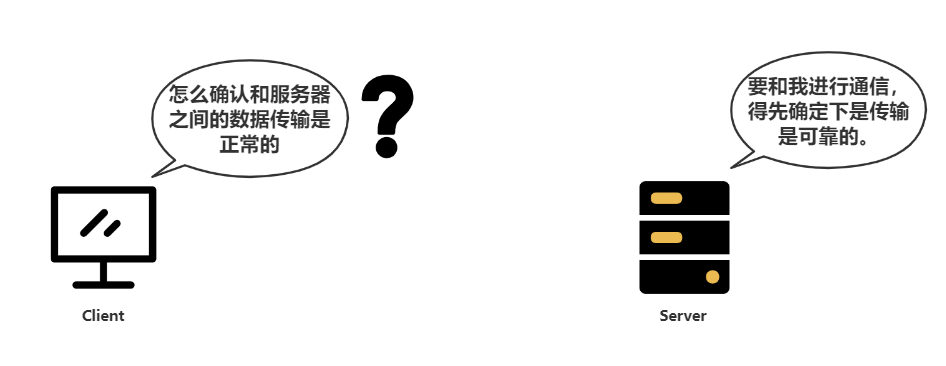

为了确认收发正常，双方都必须能够确认：**自己的消息发送过去后，对方能接收到；对方发送给自己的消息，自己能接收到**。这两个条件缺一不可。

为此，双方都必须至少发送/收到对方一条消息。通过模拟可知，不管由谁先来发，这最少需要 3 条消息。谁请求谁发送原则，客户端是第一个发送消息的那个。

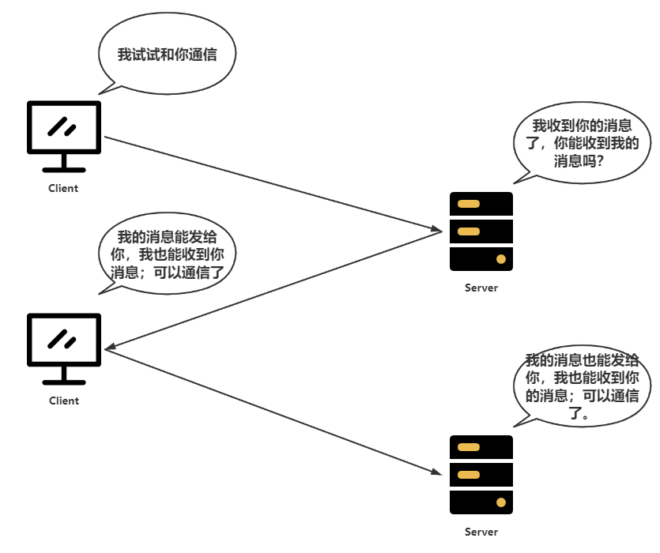

然后再看看具体的机制：

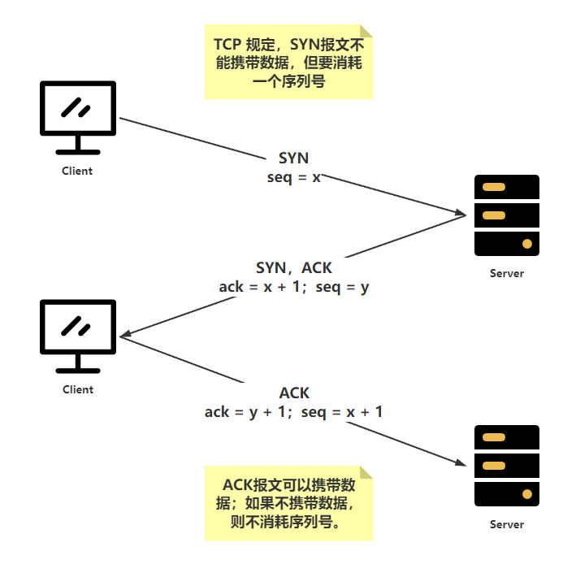

> 参阅自《计算机网络-第7版-谢希仁》-P238#TCP的连接建立

## 常问-TCP四报文挥手

## HTTPS 机制

### SSL 握手（在 TCP 建立连接之后进行）

说到 HTTPS 协议，就要说到 SSL/TLS 协议。SSL 和 TLS 这两个协议是兄弟关系。

SSL （Secure Socket Layer）已经是很多年前的东西了，现在更多的是 TLS 协议在工作（SSL的升级版协议）。

要搞懂 HTTPS 的原理，那就应该搞懂 TLS 协议是如何工作的。

#### 第一步：Client Hello

首先， 我们捕获一个这种类型的报文。

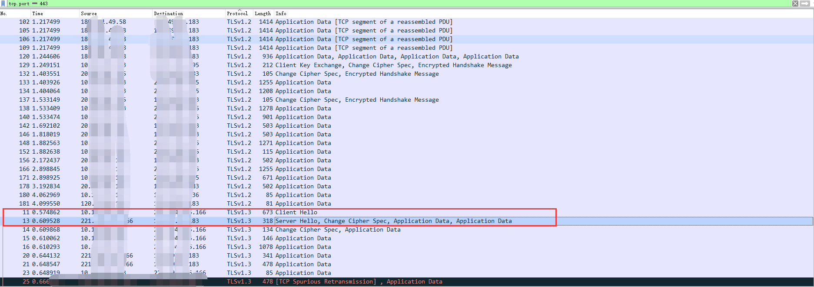

从中可以观察到 TLS 协议的数据内容。

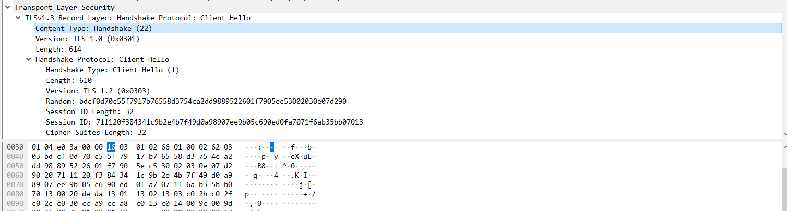

第一个字节表示内容的类型：HandShake。

后面两个字节：0301 表示协议版本为 TLS3.0，说明其实际上是 SSL 3.1。

查看 Client Hello 这条消息隐藏的信息

- Session ID

  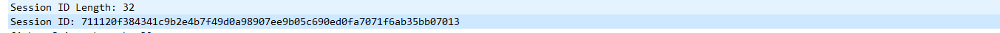使用 Session ID 可以重用之前和服务器的会话，如果该会话在服务器仍然保存，则无需创建新的会话，节省资源开销。但是 Session ID 往往是只保存在单台服务器上的，不在多服务器之间共享。为了解决这个问题，出现了 Session Ticket，Session Ticket 是加密的，只有服务端才能解密；内容包括了密钥和加密方法等。
  
- Random

  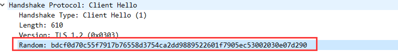

  这是客户端在第一次消息中生成的随机数，稍后用于生成"对话密钥"。

- Cipher Suites

  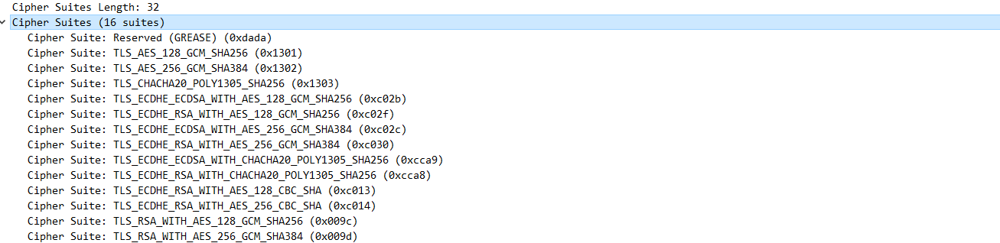这是客户端支持的加密方法集合。

- Server Name Indication extension

  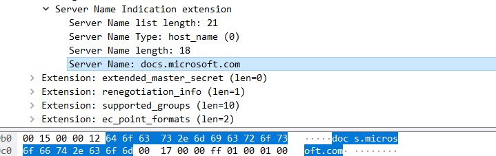

  客户端告诉服务端，自己请求的域名是 docs.microsoft.com，因为客户端向服务器发送的消息不包括服务器的域名，服务器可能会有多个域名（最好是一个域名），因此不知道向客户端提供哪个证书。因此可以使用这个信息确认所提供的证书。

#### 第二步：Server Hello

在 Client Hello 消息后的是  Server Hello。

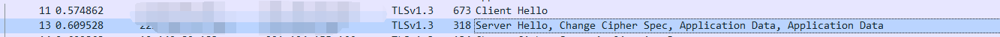

在 Server Hello 消息中，有这么几个比较重要的内容：

- Version

  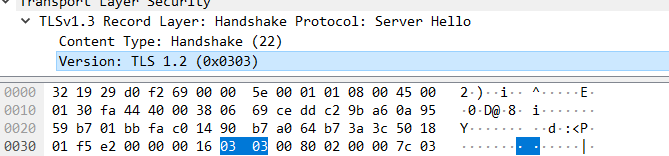

  表明服务器确定使用的协议版本为 TLS1.2。

- Random

  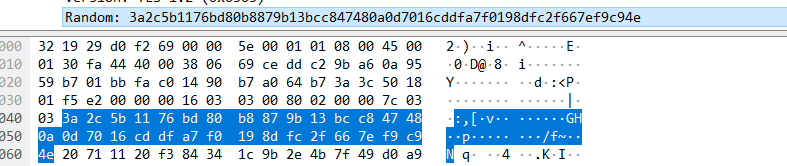

  服务器端生成的随机数，这是 TLS 握手协议中生成的第二个随机数。

- Seesion ID

  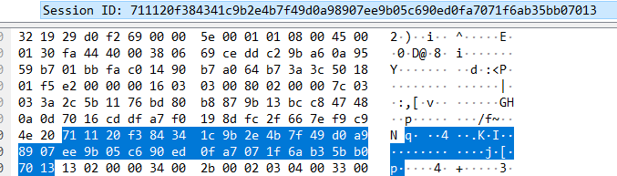

  服务端确认重用的 Session ID，这与第一步 Client 发送的 Session ID 相同。说明会重用 Session。

- Cipher Suite

  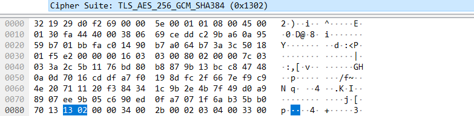

  服务端确认使用的加密算法为 TLS_AES_256_GCM_SHA384 (0x1302)；这是服务器根据第一步 Client 所支持的加密算法确定的。

  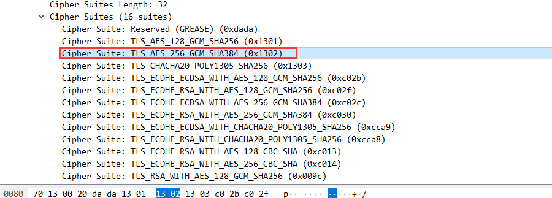

- 证书

  客户端所请求的证书，证书里有服务器的公钥。

#### 第三步：客户端回应

客户端拿到服务器提供的证书，并验证证书的有效性。如果证书有效，则会再次生成一个随机数 "pre-master-key"，这个随机数会使用证书上的公钥进行加密。

客户端对这两次发送的所有内容进行 hash，具体 hash 算法由第二次服务器确定。

这些数据会一并发送给服务端

#### 第四步：服务端回应

服务端收到了客户端发来的消息，并使用私钥解密获取 "pre-master-key"；这样，双方都有三个随机数了。因此，服务器发送握手结束通知给客户端，表明后续的消息会使用对称密钥进行加密通信。

在接下来的通信中，会使用 HTTP 通信，只不过通信内容是使用对称密钥加密的。

#### CA 证书包含了什么信息？

CA 证书包含了证书拥有者的身份信息、公钥、私钥。服务器只会向客户端发送公钥，而客户端会将证书与第三方认证机构核对证书的有效性。

#### 总结

1. 客户端发起，告诉服务器自己支持的协议版本，同时发送第一个随机数。
2. 服务器确认双方支持的最高协议版本号，并告诉客户端，同时发送客户端服务器的证书和第二个随机数。
3. 客户端对服务器发送的证书进行检验，如果该证书是由信任的机构颁布、没有过期、指向域名一致；则会使用证书上的公钥加密`pre-master-key
  `第三个随机数发送给服务器，同时告诉服务器，之后的数据传输会使用生成的密钥加密，并发送客户端发送的所有数据的一个摘要生成值。
4. 服务器使用私钥解密得到客户端加密的 `pre-mater-key`，也告诉客户端，之后的数据传输会使用对称密钥加密，也会发送服务器发送数据的一个摘要生成值。
5. 客户端收到服务端的第三个随机数，随后客户端和服务端根据这三个随机数确认对称加密密钥，然后使用对称加密密钥加密后续的通信内容。
可见，对称加密的密钥的安全性依赖于加密使用的公钥安全性。服务器必须确保其使用的私钥不被窃取。

## CSRF 跨站请求伪造攻击

假设用户 U 在网站 W1 登录了，并且保存了登录信息在本地的 Cookie 中。

当用户访问恶意网站 W2 时，W2 不知道本地的 Cookie 信息具体存储了哪些东西，但是可以利用 js 将本地的 cookie 一同发送给用户登录过的 W1，从而进行恶意操作。
Cookie 存储了什么？Cookie 保存了一些用户登录的信息：账号、密码等。这些信息都是加密过的。

### 为什么会发生

本质上是因为：从 W2 发送 HTTP 请求给 W1 和从 W1 发送是一样的。

### 如何防止

对于 `GET`、`OPTION` 等方法的 HTTP 请求，必须是幂等的（多次请求得到的结果是一样的，不修改服务器的状态）。

服务端可以在HTTP请求发生的时候，生成一个额外的标识，比如`Token`，客户端以后每次的请求就必须携带上这个标识；
这样一来，从其他网站发送的请求是不知道服务器生成的标识是什么，因此服务器会拒绝恶意网站的请求。

### 什么情况下应该开启 CSRF 保护

如果开发的应用是针对浏览器用户，那么应该开启。

